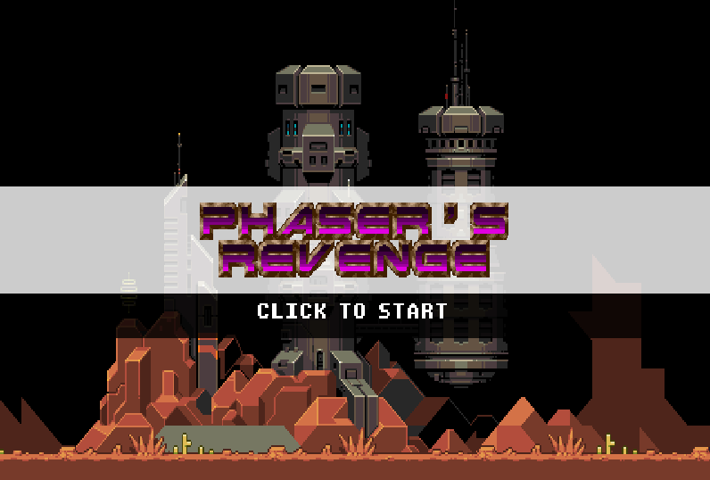

# Donjon des Maths

An educational dungeon crawler built with Phaser 3 to help kids learn multiplication tables (1-10) through engaging RPG-style combat.

## Game Features

- 🏰 **Procedurally Generated Dungeon** – Infinite exploration with connected rooms
- ⚔️ **Turn-Based Combat** – RPG-style battles with 3 enemy types (Goblin, Skeleton, Ogre)
- 🎯 **Multiplication Questions** – Each combat round requires solving a multiplication problem
- ⏱️ **Speed-Based Damage** – Faster correct answers = more damage (CRITICAL! → WEAK)
- 🎮 **Persistent Health** – Player HP carries between battles, with healing potions in the dungeon
- 📊 **Progressive Difficulty** – Stronger enemies further from spawn
- 🎵 **Dynamic Sound Effects** – 15 procedurally-generated audio effects (see [SOUND_EFFECTS.md](SOUND_EFFECTS.md))

## Installation

1. Clone the repository
2. Install dependencies with `npm install`
3. Start the development server with `npm run dev`
4. Build for production with `npm run build`

## Controls

| Input | Action |
|-------|--------|
| ↑ ↓ ← → | Move character |
| Enter | Confirm (menu, quiz) |
| 0-9 | Enter answer digits |
| Backspace | Clear last digit |

## Audio System

The game features 15 sound effects generated dynamically using Web Audio API:
- **Menu sounds**: Click, game start
- **Gameplay**: Potion pickup, footsteps, wall collision
- **Combat**: Combat start, answer feedback (critical/good/normal/weak/wrong), attacks, victory/defeat

See [SOUND_EFFECTS.md](SOUND_EFFECTS.md) for detailed documentation.

## Architecture

### Key Files

- `src/main.js` – Phaser game configuration
- `src/preloader.js` – Asset loading and sound system initialization
- `src/scenes/` – Game scenes (Menu, Game, Combat, HUD, GameOver)
- `src/gameobjects/` – Player and Enemy classes
- `src/systems/` – Game systems (Dungeon generation, Quiz logic, Sound, Score)

### Sounds

- `src/systems/SoundManager.js` – Generates and plays 15 sound effects via Web Audio API

## Game Stats

- **Enemy Types**: 3 (Goblin: 30HP, Skeleton: 50HP, Ogre: 80HP)
- **Combat Rounds**: 2-4 depending on enemy type
- **Multiplication Tables**: 1-10 (scaled by enemy difficulty)
- **Score**: Points for victories + time bonuses for fast answers

